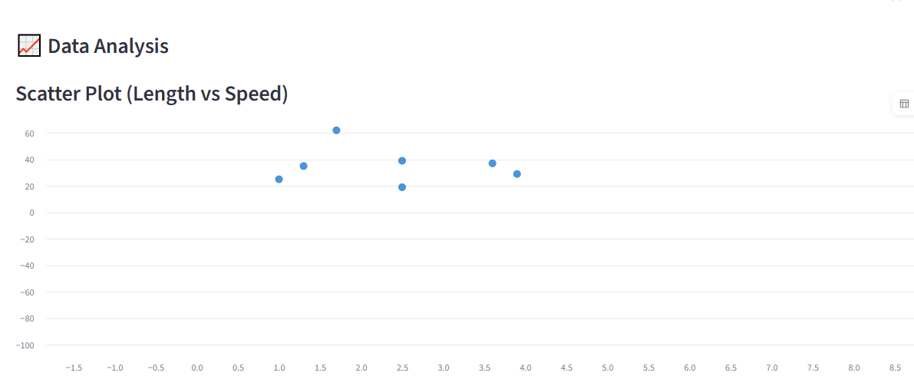
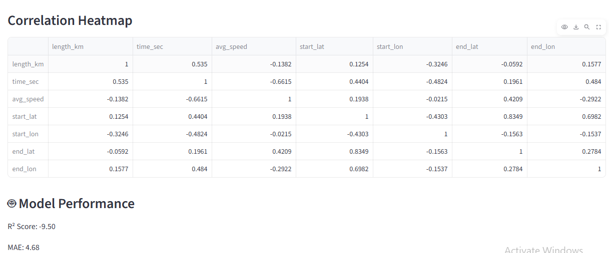
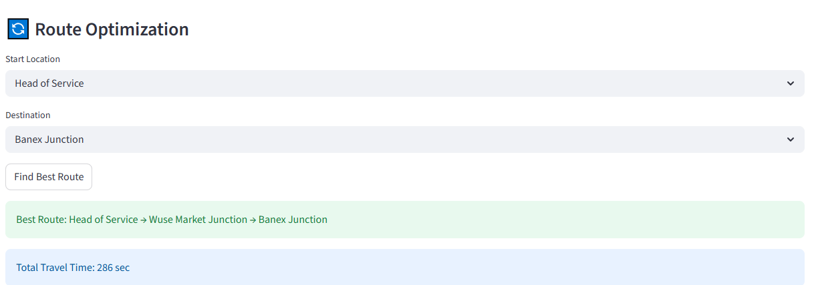
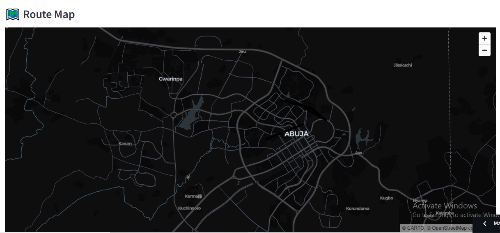

# 🚦 Smart Traffic Intelligence System (Maitama)

An intelligent traffic analytics and route optimization system built with **Python, Streamlit, Machine Learning, GIS Mapping, and Graph Algorithms**.

This project helps analyze road traffic patterns, predict travel speed, visualize traffic routes on maps, and find the fastest route between key locations in **Maitama, Abuja, Nigeria**.

🔗 **Live Demo:** https://olonisakin-k-pf.streamlit.app/

---

## 📂 Project Structure

```bash
Traffic-Intelligence-System-/
│── dad6.py
│── requirements.txt
│── assets/
│   ├── dashboard.png
│   ├── dashboard1.png
│   ├── dashboard2.png
│   ├── map.png
│   ├── map1.png
│   ├── optimization.png
│   └── predict.png
```

---

## ⚙️ Installation

### Clone Repository

```bash
git clone https://github.com/yourusername/Traffic-Intelligence-System-.git
cd Traffic-Intelligence-System-
```

### Install Requirements

```bash
pip install -r requirements.txt
```

### Run App

```bash
streamlit run dad6.py
```

---

# 📸 Application Screenshots

## 🖥️ Dashboard Overview


---

## 📊 Full Dashboard Sections





---

## 🎯 Speed Prediction


---

## 🔄 Route Optimization



---

## 🗺️ GIS Route Map




---
## 🧠 Machine Learning Model

### Random Forest Regressor

**Input Features**

* Route Length (km)
* Travel Time (sec)

**Predicted Output**

* Average Speed (km/h)

**Evaluation Metrics**

* R² Score
* Mean Absolute Error (MAE)

---

## 📈 Future Improvements

* Real-time traffic API integration
* Congestion forecasting
* Accident hotspot detection
* Google Maps integration
* Smart city traffic dashboard

---

## 👨‍💻 Author

**Kolade Olonisakin**
Data Scientist | AI Engineer | GIS Enthusiast

---

## ⭐ Support

If you found this project useful, kindly **star the repository** and share feedback.


ct useful, kindly star the repository and share feedback.
